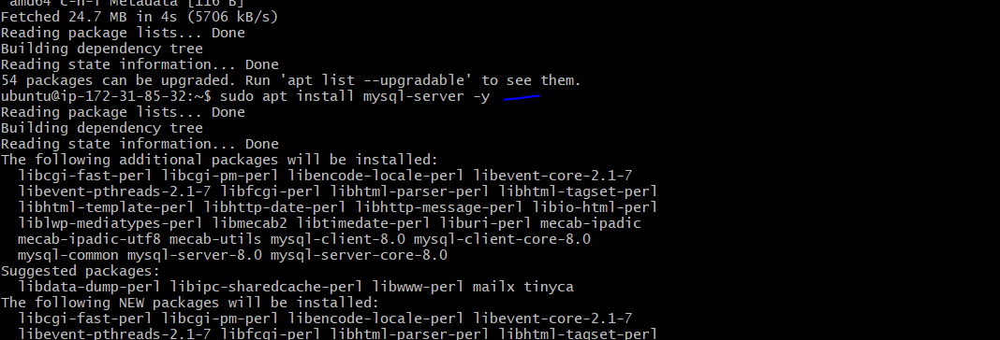
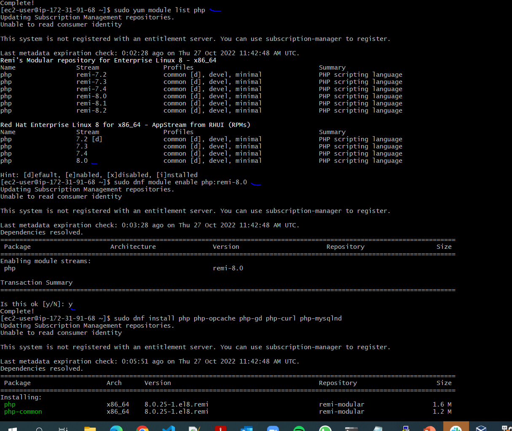

# **DEVOPS TOOLING WEBSITE SOLUTION**

## Introducing set of DevOps tools that will help in day to day activities in managing, developing, testing, deploying and monitoring different projects. The tools are well known and widely used by multiple DevOps teams;

### **1. Jenkins** – free and open source automation server used to build CI/CD pipelines.
### **2. Kubernetes** – an open-source container-orchestration system for automating computer application deployment, scaling, and management.
### **3. Jfrog Artifactory** – Universal Repository Manager supporting all major packaging formats, build tools and CI servers. Artifactory.
### **4. Rancher** – an open source software platform that enables organizations to run and manage Docker and Kubernetes in production.
### **5. Grafana** – a multi-platform open source analytics and interactive visualization web application.
### **6. Prometheus** – An open-source monitoring system with a dimensional data model, flexible query language, efficient time series database and modern alerting approach.
### **7. Kibana** – Kibana is a free and open user interface that lets you visualize your Elasticsearch data and navigate the Elastic Stack.

### In this project you will implement a solution that consists of following components:
* Infrastructure: AWS
* Webserver Linux (3 machines/instance): Red Hat Enterprise Linux 8
* Database Server: Ubuntu 20.04 + MySQL
* Storage Server: Red Hat Enterprise Linux 8 + NFS Server
* Programming Language: PHP
* Code Repository: GitHub

### On the diagram below you can see a common pattern where several stateless Web Servers share a common database and also access the same files using Network File Sytem (NFS) as a shared file storage. Even though the NFS server might be located on a completely separate hardware – for Web Servers it look like a local file system from where they can serve the same files.


## **STEP 1 – PREPARE NFS SERVER**

* Launch EC2 instances that will serve as "Web Servers". Create 3 volumes in the same AZ (availablity zone) as your Web Server EC2, each of 10 GiB.
* Attach all three volumes one by one to NFS instance and subsequently access the server via SSH from terminal.

*List all block devices attached to instance;*

`lsblk`

*Use `gdisk` utility to create a single partition on each of the 3 disks;*

`sudo gdisk /dev/xvdf` *(run same for all attached volumns)*


*Use lsblk utility to view the newly configured partition on each of the 3 disks;*

`lsblk`

*Install lvm2 package using;*

`sudo yum install lvm2`


*Run `sudo lvmdiskscan` command to check for available partitions. the `lsblk` can also be used to confirm the current block devices;*

`sudo lvmdiskscan`

*Use pvcreate utility to mark each of 3 disks as physical volumes (PVs) to be used by LVM (This can either be done on each partition or can be merged);*

`sudo pvcreate /dev/xvdf1 /dev/xvdg1 /dev/xvdh1`

*Verify that your Physical volume has been created successfully by running sudo pvs;*

`sudo pvs`

*Use vgcreate utility to add all 3 PVs to a volume group (VG). Here, "vg-webdata" is used as the name of VG;*

`sudo vgcreate webdata /dev/xvdh1 /dev/xvdg1 /dev/xvdf1`

*Verify that your VG has been created successfully by running;*

`sudo vgs`

*Use lvcreate utility to create 3 logical volumes. lv-apps (Use prefered size, in this case 9G is being allocated for all LV), lv-logs and lv-opt was also created with like volumn allocation onthe PV size. NOTE: lv-apps will be used to store data for the Website while, lv-logs will be used to store data for logs;*

`sudo lvcreate -n lv-apps -L 9G webdata`

`sudo lvcreate -n lv-logs -L 9G webdata`

`sudo lvcreate -n lv-opt -L 9G webdata`

*Verify that your Logical Volume has been created successfully by running sudo lvs;*

`sudo lvs`

*Verify the entire setup;*

`sudo vgdisplay -v #view complete setup - VG, PV, and LV`

`sudo lsblk`


*Use mkfs xfs to format (prepare) the logical volumes with xfs filesystem;*

`sudo mkfs -t xfs /dev/webdata/lv-apps`

`sudo mkfs -t xfs /dev/webdata/lv-logs`

`sudo mkfs -t xfs /dev/webdata/lv-opt`


*Create mount points on /mnt directory for the logical volumes as follow and subsequently month the LV to the appropriate mount point created:*

`sudo mkdir /mnt/apps /mnt/logs /mnt/opt`

`sudo mount /dev/webdata/lv-apps /mnt/apps`

`sudo mount /dev/webdata/lv-logs /mnt/logs`

`sudo mount /dev/webdata/lv-opt /mnt/opt`


*Install NFS server, configure it to start on reboot and make sure it is u and running;*

`sudo yum -y update`

`sudo yum install nfs-utils -y`

*Run the below command to Start, enable and check status of nfs server. **Note:** while installing the nfs, lauch andother terminal to setup db server*

`sudo systemctl start nfs-server.service`

`sudo systemctl enable nfs-server.service`

`sudo systemctl status nfs-server.service`


**STEP 2 — CONFIGURE THE DATABASE SERVER**

*Update server (ubuntu)*

`sudo apt update -y`


*Install mysql server;*

`sudo apt install mysql-server`



*Access mysql and create database;*

`sudo mysql`

`create database tooling;`

*Create a user on the db;*

`create user 'webaccess'@'web-server-IP-address(cidr)' identified by 'password';`

*Grant permission of the create user(s) to the create database(s);*

`grant all privileges on tooling.* to ''webaccess'@'web-server-IP-address(cidr)';`

`flush privileges;`


**CONTINUE FROM THE NFS SERVER TERMINAL (after NFS installation is complete)**

*Setup permission to enable web servers  to read, write and execute files on NFS server. chwon: changes owner while chmod: changes permission. Restart nfs service;*

`sudo chown -R nobody: /mnt/apps`

`sudo chown -R nobody: /mnt/logs`

`sudo chown -R nobody: /mnt/opt`

`sudo chmod -R 777 /mnt/apps`

`sudo chmod -R 777 /mnt/logs`

`sudo chmod -R 777 /mnt/opt`

`sudo systemctl restart nfs-server.service`


*Configure access to NFS for clients within the same subnet (example of Subnet CIDR – 172.31.32.0/20 ). Here, these are within same subnet (replace IP adress accordingly). This can be done using your prefered editor and save afterwards;*

`sudo vi /etc/exports`

```
/mnt/apps 172.31.80.0/20(rw,sync,no_all_squash,no_root_squash)
/mnt/logs 172.31.80.0/20(rw,sync,no_all_squash,no_root_squash)
/mnt/opt 172.31.80.0/20(rw,sync,no_all_squash,no_root_squash)
```

*Run below command to export the settings above. This enables the web servers to see it when they connecting;*

`sudo exportfs -arv`

*Check which port is used by NFS and open it using Security Groups (add new Inbound Rule)*

`rpcinfo -p | grep nfs`

***Important note:** In order for NFS server to be accessible from your client, you must also open following ports: TCP 111, UDP 111, UDP 2049. This can be done in the security group*


### **Step 3 — Prepare the Web Servers** 
### We need to make sure that our Web Servers can serve the same content from shared storage solutions, in our case – NFS Server and MySQL database. One DB can be accessed for reads and writes by multiple clients. For storing shared files that our Web Servers will use – we will utilize NFS and mount previously created Logical Volume lv-apps to the folder where Apache stores files to be served to the users (/var/www). This approach will make our Web Servers stateless, which means we will be able to add new ones or remove them whenever we need, and the integrity of the data (in the database and on NFS) will be preserved.

### During the next steps we will do following:
* Configure NFS client (this step must be done on all three servers)
* Deploy a Tooling application to our Web Servers into a shared NFS folder
* Configure the Web Servers to work with a single MySQL database

*Launch a new EC2 instance with RHEL 8 Operating System and Install NFS client*

`sudo yum update -y`

`sudo yum upgrade -y`

`sudo yum install nfs-utils nfs4-acl-tools -y`


*Mount /var/www/ and target the NFS server’s export for apps*

`sudo mkdir /var/www`

`sudo mount -t nfs -o rw,nosuid <NFS-Server-Private-IP-Address>:/mnt/apps /var/www`

*Verify that NFS was mounted successfully by running;*

`df -h`

### *Note: A test can be done by creating a file while on the web server, then access the NFS server to confirm if the file is present in the same directory.*

*Make sure that the changes will persist on Web Server after reboot. Using your prefered editor make the changes and save it.*

`sudo vi /etc/fstab`

```
<172.31.95.25(NFS-Server-Private-IP-Address)>:/mnt/apps /var/www nfs defaults 0 0
```

**NOTE: Replicate these steps (done on this web server) on ther other 2 web servers;**

*Install Apache (web server);*

`sudo yum install httpd -y`


*Verify that Apache files and directories are available on the Web Server in /var/www and also on the NFS server in /mnt/apps. If you see the same files – it means NFS is mounted correctly. You can try to create a new file touch test.txt from one server and check if the same file is accessible from other Web Servers.*

*Navigate to /var/www directory and run the below command to view files which were created during the installation of Apache;*
*Creating the test file;*

`sudo touch /var/www/test.md`

*Confirm file creation;*

`ls /var/www`

*Locate the log folder for Apache on the Web Server and mount it to NFS server’s export for logs. Repeat step №4 to make sure the mount point will persist after reboot.*

`ls /var`

`ls /var/log`

`ls /var/log/httpd`

*Mounting log folder on NFS server*

`sudo mount -t nfs -o rw,nosuid <NFS-Server-Private-IP-Address>:/mnt/logs /var/log/httpd`

*To make sure the mount persist, even after reboot, modify the file after accessing it with prefered editor with the information below;*

`sudo vi /etc/fstab`

```
<172.31.95.25(NFS-Server-Private-IP-Address)>:/mnt/logs /var/log/httpd nfs defaults 0 0
```


*Fork the tooling source code from Darey.io Github Account to your Github account (first install git);*

`sudo yum install git -y`

`git clone https://github.com/darey-io/tooling`


*Deploy the tooling website’s code to the Webserver. Ensure that the html folder from the repository is deployed to /var/www/html*

`ls`

*Navigate to the tooling directory to confirm the files;*

`cd tooling`

*Copying html file and its content from the tooling directory to /var/www/html directory;*
`sudo cp -R html/. /var/www/html`


*Confirm that the copied files content is same for both location (check both the one in the tooling directory and also in the /var/www/html directory);*

`ls /var/www/html`

`ls html`


*Modify securiy group for web servers to allow inbound traffic on port 80;*

*If you encounter 403 Error – check permissions to your /var/www/html folder and also disable SELinux with `sudo setenforce 0`;*

`sudo setenforce 0`

*To make this change permanent – open following config file sudo vi /etc/sysconfig/selinux and set SELINUX=disabled then restrt httpd*

`sudo vi /etc/sysconfig/selinux`

```
# cat /etc/sysconfig/selinux

# This file controls the state of SELinux on the system.
# SELINUX= can take one of these three values:
#     enforcing - SELinux security policy is enforced.
#     permissive - SELinux prints warnings instead of enforcing.
#     disabled - No SELinux policy is loaded.
SELINUX=disabled
# SELINUXTYPE= can take one of these two values:
#     targeted - Targeted processes are protected,
#     mls - Multi Level Security protection.
SELINUXTYPE=targeted
```
*Restart apache then access a web browser while also using the public IP address access the web server;*

`sudo systemctl restart httpd`


*Access the functions.php file using vim and Update the website’s configuration to connect to the database (in /var/www/html/functions.php file). In this case user credentials of the user created in the db earlier (Screen shot after the code will indicate) and save the changes;*

`sudo vi /var/www/html/functions.php`

```
<?php 
session_start();

// connect to database
$db = mysqli_connect('enter private IP address of db server', 'webaccess', 'password', 'tooling');

// Check connection
// if (mysqli_connect_errno()) {
// echo "Failed to connect to MySQL: " . mysqli_connect_error();
// exit();
// }
// else{
// echo "connected";
// }

// variable declaration
$username = "";
$email    = "";
$errors   = array(); 

// call the register() function if register_btn is clicked
if (isset($_POST['register_btn'])) {
	register();
}

// REGISTER USER
function register(){
	// call these variables with the global keyword to make them available in function
	global $db, $errors, $username, $email;

	// receive all input values from the form. Call the e() function
    // defined below to escape form values
	$username    =  e($_POST['username']);
	$email       =  e($_POST['email']);
	$password_1  =  e($_POST['password_1']);
	$password_2  =  e($_POST['password_2']);

	// form validation: ensure that the form is correctly filled
	if (empty($username)) { 
		array_push($errors, "Username is required"); 
	}
	if (empty($email)) { 
		array_push($errors, "Email is required"); 
	}
	if (empty($password_1)) { 
		array_push($errors, "Password is required"); 
	}
	if ($password_1 != $password_2) {
		array_push($errors, "The two passwords do not match");
	}

	// register user if there are no errors in the form
	if (count($errors) == 0) {
		$password = md5($password_1);//encrypt the password before saving in the database

		if (isset($_POST['user_type'])) {
			$user_type = e($_POST['user_type']);
			$query = "INSERT INTO users (username, email, user_type, password) 
					  VALUES('$username', '$email', '$user_type', '$password')";
			mysqli_query($db, $query);
			$_SESSION['success']  = "New user successfully created!!";
			header('location: admin_tooling.php');
		}else{
			$query = "INSERT INTO users (username, email, user_type, password) 
					  VALUES('$username', '$email', 'user', '$password')";
			mysqli_query($db, $query);

			// get id of the created user
			$logged_in_user_id = mysqli_insert_id($db);

			$_SESSION['user'] = getUserById($logged_in_user_id); // put logged in user in session
			$_SESSION['success']  = "You are now logged in";
			header('location: index.php');				
		}
	}
}

// return user array from their id
function getUserById($id){
	global $db;
	$query = "SELECT * FROM users WHERE id=" . $id;
	$result = mysqli_query($db, $query);

	$user = mysqli_fetch_assoc($result);
	return $user;
}

// escape string
function e($val){
	global $db;
	return mysqli_real_escape_string($db, trim($val));
}

function display_error() {
	global $errors;

	if (count($errors) > 0){
		echo '<div class="error">';
			foreach ($errors as $error){
				echo $error .'<br>';
			}
		echo '</div>';
	}
}

function isLoggedIn()
{
	if (isset($_SESSION['user'])) {
		return true;
	}else{
		return false;
	}
}

if (isset($_GET['logout'])) {
	session_destroy();
	unset($_SESSION['user']);
	header("location: login.php");
}

// call the login() function if register_btn is clicked
if (isset($_POST['login_btn'])) {
	login();
}

// LOGIN USER
function login(){
	global $db, $username, $errors;

	// grap form values
	$username = e($_POST['username']);
	$password = e($_POST['password']);

	// make sure form is filled properly
	if (empty($username)) {
		array_push($errors, "Username is required");
	}
	if (empty($password)) {
		array_push($errors, "Password is required");
	}

	// attempt login if no errors on form
	if (count($errors) == 0) {
		$password = md5($password);

		$query = "SELECT * FROM users WHERE username='$username' AND password='$password' LIMIT 1";
		$results = mysqli_query($db, $query);

		if (mysqli_num_rows($results) == 1) { // user found
			// check if user is admin or user
			$logged_in_user = mysqli_fetch_assoc($results);
			if ($logged_in_user['user_type'] == 'admin') {

				$_SESSION['user'] = $logged_in_user;
				$_SESSION['success']  = "You are now logged in";
				header('location: admin_tooling.php');		  
			}else{
				$_SESSION['user'] = $logged_in_user;
				$_SESSION['success']  = "You are now logged in";

				header('location: index.php');
			}
		}else {
			array_push($errors, "Wrong username/password combination");
		}
	}
}

function isAdmin()
{
	if (isset($_SESSION['user']) && $_SESSION['user']['user_type'] == 'admin' ) {
		return true;
	}else{
		return false;
	}
}
```


*Navigate to the tooling directory and install mysql client;*

`sudo yum install mysql -y`

*Modify the security group attached on mysql server to allow traffic on port 3306 (MYSQL/Aurora) from web server/mysql client*

*Update binding address on mysql config file*

`sudo vi /etc/mysql/mysql.conf.d/mysqld.cnf`

```
#
# The MySQL database server configuration file.
#
# One can use all long options that the program supports.
# Run program with --help to get a list of available options and with
# --print-defaults to see which it would actually understand and use.
#
# For explanations see
# http://dev.mysql.com/doc/mysql/en/server-system-variables.html

# Here is entries for some specific programs
# The following values assume you have at least 32M ram

[mysqld]
#
# * Basic Settings
#
user = mysql
# pid-file = /var/run/mysqld/mysqld.pid
# socket = /var/run/mysqld/mysqld.sock
# port = 3306
# datadir = /var/lib/mysql


# If MySQL is running as a replication slave, this should be
# changed. Ref https://dev.mysql.com/doc/refman/8.0/en/server-system-variables.html#sysvar_tmpdir
# tmpdir = /tmp
#
# Instead of skip-networking the default is now to listen only on
# localhost which is more compatible and is not less secure.
bind-address = 0.0.0.0
mysqlx-bind-address = 0.0.0.0
#
# * Fine Tuning
#
key_buffer_size = 16M
# max_allowed_packet = 64M
# thread_stack = 256K

# thread_cache_size = -1

# This replaces the startup script and checks MyISAM tables if needed
# the first time they are touched
myisam-recover-options = BACKUP

# max_connections = 151

# table_open_cache = 4000

#
# * Logging and Replication
#
# Both location gets rotated by the cronjob.
#
# Log all queries
# Be aware that this log type is a performance killer.
# general_log_file = /var/log/mysql/query.log
# general_log = 1
#
# Error log - should be very few entries.
#
log_error = /var/log/mysql/error.log
#
# Here you can see queries with especially long duration
# slow_query_log = 1
# slow_query_log_file = /var/log/mysql/mysql-slow.log
# long_query_time = 2
# log-queries-not-using-indexes
#
# The following can be used as easy to replay backup logs or for replication.
# note: if you are setting up a replication slave, see README.Debian about
# other settings you may need to change.
# server-id = 1
# log_bin = /var/log/mysql/mysql-bin.log
# binlog_expire_logs_seconds = 2592000
max_binlog_size = 100M
# binlog_do_db = include_database_name
# binlog_ignore_db = include_database_name
```


*After updating the binding address, restart mysql;*

`sudo systemctl restart mysql`

*From the web server, Apply tooling-db.sql script to your database using this command mysql -h <databse-private-ip> -u <db-username> -p <db-pasword> < tooling-db.sql*

`mysql -h <databse-private-ip> -u webaccess -p password < tooling-db.sql`


*Go back to the database machine via terminal and perform some command (like below) to verify the tooling-db.sql script;*

`show databases;`

`show tables;`

`select * from users`

***tooling-db.sql script***

```
-- phpMyAdmin SQL Dump
-- version 5.0.2
-- https://www.phpmyadmin.net/
--
-- Host: 127.0.0.1
-- Generation Time: Oct 14, 2020 at 03:51 PM
-- Server version: 10.4.14-MariaDB
-- PHP Version: 7.4.9
SET SQL_MODE = "NO_AUTO_VALUE_ON_ZERO";
START TRANSACTION;
SET time_zone = "+00:00";
/*!40101 SET @OLD_CHARACTER_SET_CLIENT=@@CHARACTER_SET_CLIENT */
;
/*!40101 SET @OLD_CHARACTER_SET_RESULTS=@@CHARACTER_SET_RESULTS */
;
/*!40101 SET @OLD_COLLATION_CONNECTION=@@COLLATION_CONNECTION */
;
/*!40101 SET NAMES utf8mb4 */
;
--
-- Database: `multi_login`
--
-- --------------------------------------------------------
--
-- Table structure for table `users`
--
CREATE TABLE `users` (
  `id` int(11) NOT NULL,
  `username` varchar(255) NOT NULL,
  `password` varchar(255) NOT NULL,
  `email` varchar(255) NOT NULL,
  `user_type` varchar(255) NOT NULL,
  `status` varchar(10) NOT NULL
) ENGINE = InnoDB DEFAULT CHARSET = utf8mb4;
--
-- Dumping data for table `users`
--
INSERT INTO `users` (
    `id`,
    `username`,
    `password`,
    `email`,
    `user_type`,
    `status`
  )
VALUES (
    1,
    'admin',
    '21232f297a57a5a743894a0e4a801fc3',
    'dare@dare.com',
    'admin',
    '1'
  );
--
-- Indexes for dumped tables
--
--
-- Indexes for table `users`
--
ALTER TABLE `users`
ADD PRIMARY KEY (`id`);
--
-- AUTO_INCREMENT for dumped tables
--
--
-- AUTO_INCREMENT for table `users`
--
ALTER TABLE `users`
MODIFY `id` int(11) NOT NULL AUTO_INCREMENT,
  AUTO_INCREMENT = 3;
COMMIT;
/*!40101 SET CHARACTER_SET_CLIENT=@OLD_CHARACTER_SET_CLIENT */
;
/*!40101 SET CHARACTER_SET_RESULTS=@OLD_CHARACTER_SET_RESULTS */
;
/*!40101 SET COLLATION_CONNECTION=@OLD_COLLATION_CONNECTION */
;
```
*Disable Apache welcome page using below command to back it up in another location. This can be done while in the tooling directory of the web server;*

`sudo mv /etc/httpd/conf.d/welcome.conf /etc/httpdconf.d/welcome.conf_backup`

*Restart and also check status of Apache. Then refresh the web browser to confirm site is accessible*

`sudo systemctl restart httpd`

`sudo systemctl status httpd`

*Install php dependencies to ensure to help display components of site to endusers properly;*

`sudo dnf install https://dl.fedoraproject.org/pub/epel/epel-release-latest-8.noarch.rpm -y`


`sudo dnf install dnf-utils http://rpms.remirepo.net/enterprise/remi-release-8.rpm -y`


`sudo yum module list php`

`sudo dnf module reset php`


`sudo dnf module enable php:remi-8.0 -y`

`sudo dnf install php php-opcache php-gd php-curl php-mysqlnd -y`



`sudo systemctl start php-fpm`

`sudo systemctl enable php-fpm`

`setsebool -P httpd_execmem 1`

*Refresh browser and if still same, then restart Apache. Then enter credentials to access the portal*

`sudo systemctl restart httpd`

